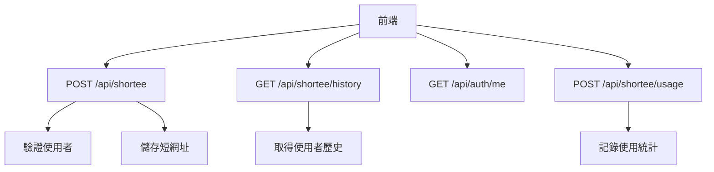
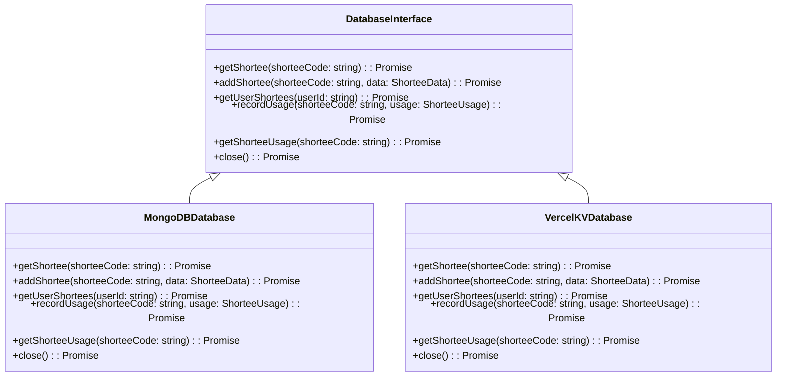
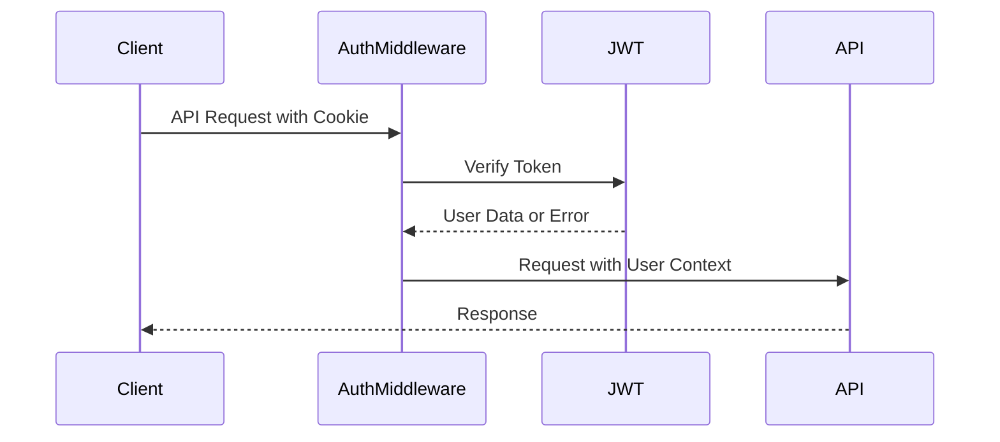
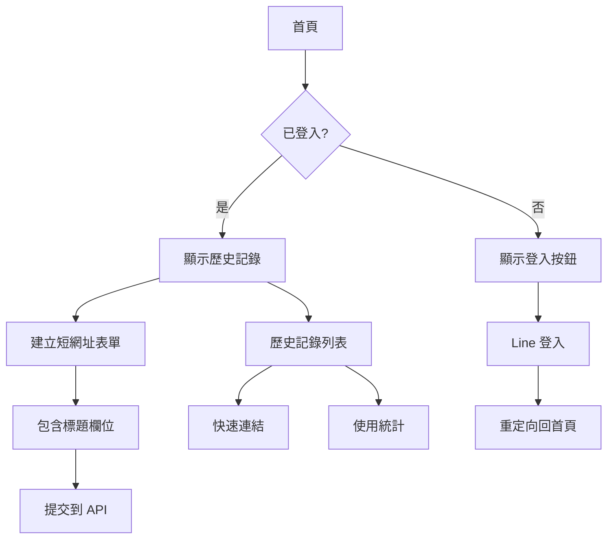
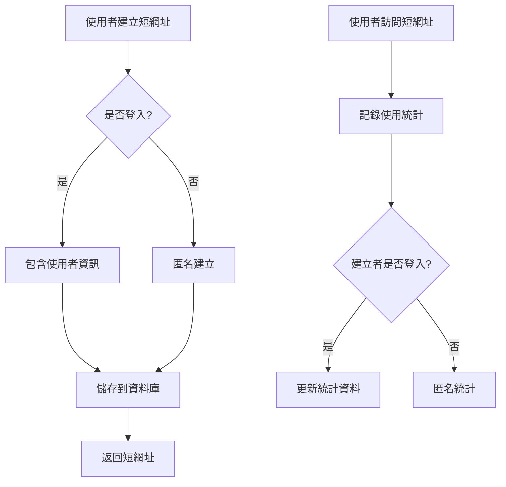

# 使用者認證功能設計文件

## 系統分析 (SA)

### 1. 功能需求分析

**核心功能：**
1. **使用者認證整合**：將現有的 Line 登入與短網址功能整合
2. **短網址歷史記錄**：登入使用者可以查看自己建立的短網址列表
3. **短網址標題功能**：允許使用者為短網址添加標題，方便識別
4. **快速連結功能**：在歷史記錄中提供快速點擊連結

### 2. 資料模型擴展

```mermaid
classDiagram
    class User {
        +String userId
        +String name
        +String email
        +String provider
        +String providerId
        +Date createdAt
        +Date updatedAt
    }
    
    class ShorteeData {
        +String shorteeCode
        +String origin
        +String title
        +String userId
        +String provider
        +String providerId
        +Date createdAt
        +Date updatedAt
    }
    
    class ShorteeUsage {
        +String shorteeCode
        +String userId
        +Date accessedAt
        +String userAgent
        +String ipAddress
    }
    
    User ||--o{ ShorteeData : creates
    ShorteeData ||--o{ ShorteeUsage : tracks
```

### 3. API 端點設計



## 系統設計 (SD)

### 1. 資料庫介面擴展



### 2. 認證中介軟體設計



### 3. 前端頁面流程



### 4. 資料流程設計



## 實作建議

### 1. 優先順序
1. **Phase 1**: 擴展資料庫介面，支援使用者關聯
2. **Phase 2**: 修改短網址 API，支援標題和使用者資訊
3. **Phase 3**: 新增歷史記錄 API
4. **Phase 4**: 實作前端歷史記錄頁面
5. **Phase 5**: 新增使用統計功能

### 2. 技術考量
- **向後相容性**: 匿名使用者仍可建立短網址
- **效能**: 歷史記錄分頁載入
- **安全性**: JWT token 驗證
- **使用者體驗**: 快速載入和響應式設計

### 3. 資料庫遷移策略
- 新增使用者相關欄位，預設值為 null
- 逐步遷移現有資料
- 保持向後相容性

## 實作進度

- [x] 設計文件完成
- [x] Phase 1: 擴展資料庫介面
- [x] Phase 2: 修改短網址 API
- [x] Phase 3: 新增歷史記錄 API
- [x] Phase 4: 實作前端歷史記錄頁面
- [x] Phase 5: 新增使用統計功能 